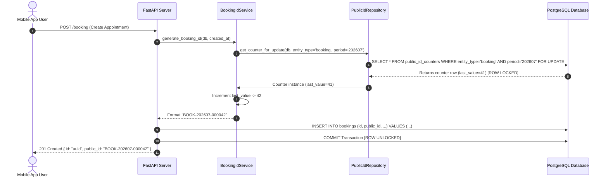

# Human-Readable Booking ID System (`BOOK-YYYYMM-XXXXXX`)

## 1. Overview & Business Context
The **Humal** platform uses 128-bit UUIDs (`uuid.uuid4`) as internal Primary Keys for database entities. While ideal for distributed scaling, UUIDs are cumbersome for veterinary staff, support agents, and farmers during phone calls and customer support lookup.

The **Human-Readable Booking ID System** introduces a standardized, sequential string format (`BOOK-YYYYMM-000001`) that is uniquely assigned to every booking upon creation, while preserving UUIDs as internal foreign keys.

---

## 2. Format Specification
```text
  PREFIX   YEAR & MONTH   MONOTONIC SEQUENCE
  ┌──┴──┐    ┌───┴───┐        ┌───┴───┐
   BOOK   -   202607   -       000001
```

- **Prefix (`BOOK`)**: Identifies the entity type as a Booking.
- **Period (`YYYYMM`)**: 6-digit year and month string in Indian Standard Time (IST, UTC+5:30) (e.g., `202607` for July 2026).
- **Sequence Number (`000001`)**: 6-digit zero-padded integer, incrementing monotonically and resetting to `000001` at the start of each month.

---

## 3. Database Architecture & Row-Level Locking
To prevent duplicate ID generation under high concurrent API request volume (e.g., flash booking drives or emergency outbreak consultations), sequence counter state is managed using a dedicated row-locked counter table (`public_id_counters`).

### Schema Definition
```sql
CREATE TABLE public_id_counters (
    entity_type VARCHAR(50) NOT NULL,
    period VARCHAR(10) NOT NULL,
    last_value BIGINT NOT NULL DEFAULT 0,
    updated_at TIMESTAMP WITHOUT TIME ZONE DEFAULT (now() AT TIME ZONE 'utc'),
    PRIMARY KEY (entity_type, period)
);

ALTER TABLE bookings ADD COLUMN public_id VARCHAR(30) UNIQUE;
CREATE UNIQUE INDEX ix_bookings_public_id ON bookings (public_id);
```

### Concurrent Generation Flow


---

## 4. API & Search Integration
All booking responses expose both the internal `id` (UUID) and `public_id`:

```json
{
  "id": "0d18d44f-8db6-4c35-b5b4-df85d5b4c98b",
  "public_id": "BOOK-202607-000042",
  "booking_date": "2026-07-28",
  "consultation_type": "visit",
  "status": "CONFIRMED"
}
```

Support agents and admin users can query endpoints using either format:
- `GET /admin/consults?search=BOOK-202607-000042`
- `GET /support/booking-context/BOOK-202607-000042`

---

## 5. Migration Strategy for Existing Data
Existing database records are populated using the Python migration script [`scripts/migrate_booking_public_ids.py`](file:///Users/neerajagrawal/Desktop/Humal/farmer-vet-backend/scripts/migrate_booking_public_ids.py):

```bash
python farmer-vet-backend/scripts/migrate_booking_public_ids.py
```
This iterates over all unassigned bookings sorted by `created_at` timestamp and assigns sequential `BOOK-YYYYMM-XXXXXX` identifiers chronologically.

---

## 6. Future Extensibility Roadmap
The `PublicIdCounter` architecture is generic and reusable across all upcoming business entities:

| Entity | Prefix | Period Format | Example ID |
| :--- | :--- | :--- | :--- |
| **Booking** | `BOOK` | `YYYYMM` | `BOOK-202607-000042` |
| **Payment** | `PAY` | `YYYYMM` | `PAY-202607-000128` |
| **Vet Payout** | `POUT` | `YYYYMM` | `POUT-202607-000085` |
| **Support Ticket** | `TCK` | `YYYYMM` | `TCK-202607-000019` |
